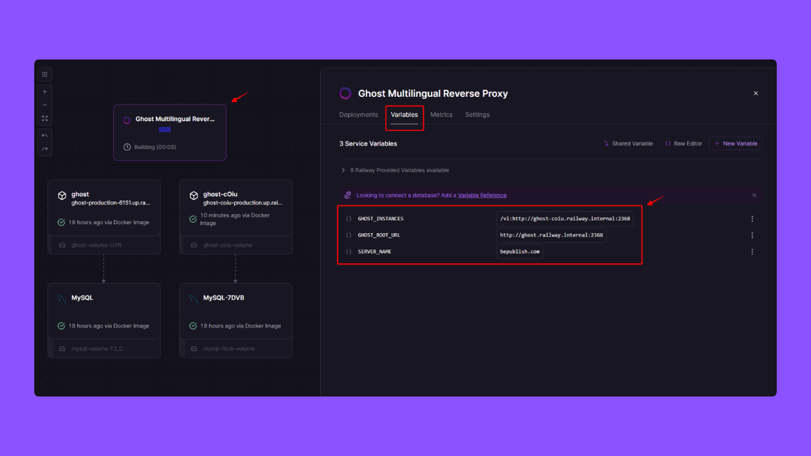
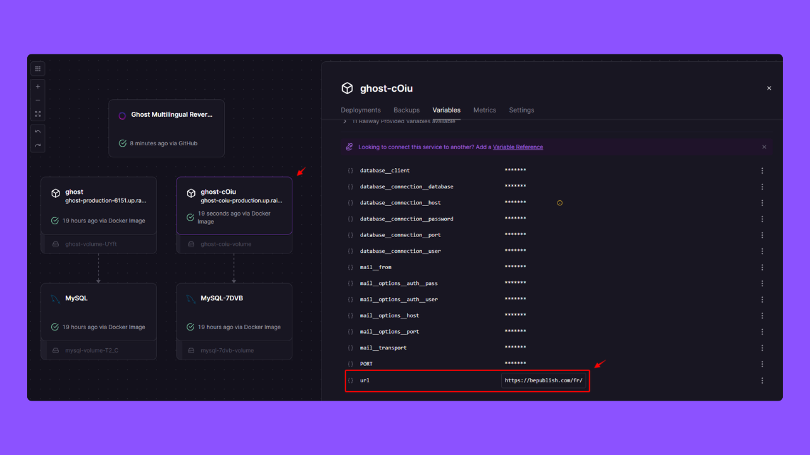
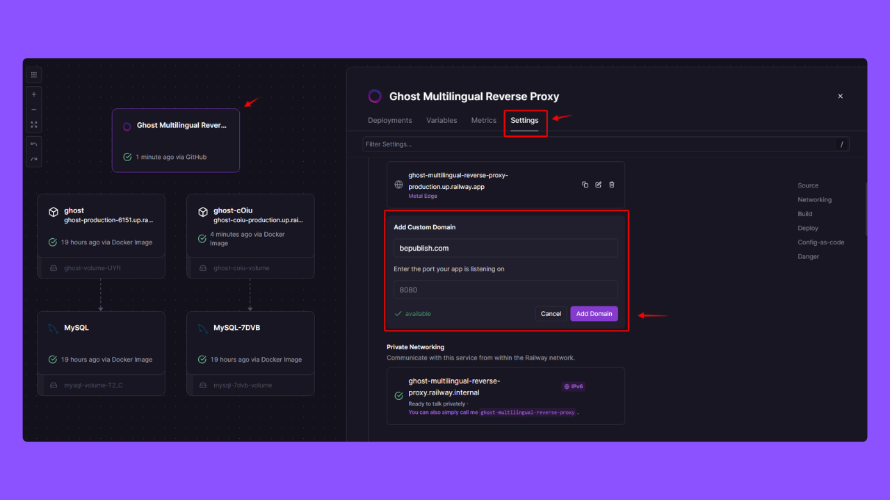

# Ghost Multilingual Reverse Proxy


> A Railway-ready template to host multiple Ghost blogs under a single domain with subdirectory routing.

This project is a Dockerized Nginx reverse proxy designed to route traffic to multiple [Ghost CMS](https://ghost.org?via=cuong76) instances based on the URL path. It is optimized for deployment on [Railway](https://railway.com/deploy/ghost-multilingual-reverse-proxy?referralCode=cuongthach&utm_medium=integration&utm_source=template&utm_campaign=generic).

## How It Works

The Nginx server is configured to act as a reverse proxy:
- A main Ghost instance is served from the root path (`/`).
- Multiple additional Ghost instances can be served from different sub-paths (e.g., `/fr/`, `/es/`).
- A `/health` endpoint is provided for health checks.

**Note:** While this template is optimized for Ghost CMS, it is a flexible Nginx reverse proxy that can route traffic to any web service. You can use it to manage and consolidate access to various applications, such as documentation sites, APIs, or other CMS platforms, under a single domain.

## Features

- **Dynamic Multi-Instance Routing:** Route traffic to a main Ghost instance and unlimited additional instances based on URL paths.
- **Health Check Endpoint:** Includes a `/health` endpoint for monitoring and health checks.
- **Dockerized & Optimized for Railway:** A lightweight, production-ready Docker image optimized for zero-downtime deployments on Railway.

## Why Use This Project?

- **Consolidate Your Content:** Run multiple Ghost blogs (e.g., for different languages or topics) on a single domain, like `your-domain.com/en` and `your-domain.com/fr`.
- **Integrate a Documentation Site:** Use the proxy to route a path like `/docs/` to a separate documentation site (e.g., Docusaurus, GitBook, or another static site generator), keeping all your content under one domain.
- **Save on Hosting Costs:** Serve multiple sites from one server, significantly reducing your hosting expenses compared to paying for separate plans.
- **Simplify Your Workflow:** Manage all your sites from a single, centralized proxy, simplifying deployment and administration.
- **Deploy with Confidence:** Built for high availability with zero-downtime deployments and automatic restarts on Railway.
- **Launch in Minutes:** Get started quickly with the one-click "Deploy on Railway" button and minimal configuration.

## Environment Variables

To configure the reverse proxy, you will need to set the following environment variables:

| Variable | Description | Example | Required |
|---|---|---|---|
| `SERVER_NAME` | The domain name for the Nginx server. | `your-domain.com` | **Yes** |
| `GHOST_ROOT_URL` | The internal URL of the main Ghost instance (for the `/` path). | `http://ghost-en.internal:2368` | **Yes** |
| `GHOST_INSTANCES` | A comma-separated list of additional Ghost instances. Each instance is a `path:url` pair. | `/fr:http://ghost-fr:2368` | No |
| `PORT` | The port for Nginx to listen on. Defaults to `8080`. | `8080` | No |

**Important:** Each Ghost instance must be configured with the correct `url` in its own configuration file to match the proxy. For example, an instance proxied at `/fr/` must have its `url` set to `https://your-domain.com/fr/`.


## Deployment to Railway

[](https://railway.com/deploy/ghost-multilingual-reverse-proxy?referralCode=cuongthach&utm_medium=integration&utm_source=template&utm_campaign=generic)

### Step 1: Deploy the Template


1.  Click the 'Deploy on Railway' button above.
2.  Follow the instructions to create the repository and deploy the service.

### Step 2: Configure Environment Variables



1.  In your new Railway project, navigate to the `ghost-multilingual-reverse-proxy` service settings and go to the **Variables** tab.
2.  Add the required environment variables based on the "Environment Variables" section above.
    *   `SERVER_NAME`: Your custom domain (e.g., `your-domain.com`).
    *   `GHOST_ROOT_URL`: The internal URL of your main Ghost instance on Railway (e.g., `http://ghost-en.railway.internal:2368`).
    *   `GHOST_INSTANCES`: The path and internal URL for your other Ghost instances (e.g., `/fr:http://ghost-fr.railway.internal:2368`).

### Step 3: Configure Ghost Instances



This is a critical step. For the reverse proxy to work correctly, you must update the public URL in each of your Ghost instances.

1.  Go to the settings for your **main** Ghost instance on Railway.
2.  In the **Variables** tab, set the `url` variable to your full public domain.
    *   Example: `https://your-domain.com`
3.  Go to the settings for your **additional** Ghost instance (e.g., the French version).
4.  In the **Variables** tab, set the `url` variable to your full public domain including the subdirectory path.
    *   Example: `https://your-domain.com/fr/`

### Step 4: Expose to the Web



1.  In the `ghost-multilingual-reverse-proxy` service settings on Railway, go to the **Settings** tab.
2.  Under the "Networking" section, click on **Generate Domain** to get a free `*.up.railway.app` subdomain, or click **+ Add Domain** to link your own custom domain.
3.  Ensure the domain points to the service port `8080`.

## Local Development

To run this project locally, you can use the provided Dockerfile.

1.  **Build the Docker image:**
    ```bash
    docker build -t ghost-multilingual-reverse-proxy .
    ```

2.  **Run the Docker container:**
    ```bash
    docker run -d -p 8080:8080 \
        -e SERVER_NAME=localhost \
        -e GHOST_ROOT_URL=http://localhost:2368 \
        -e GHOST_INSTANCES="/fr:http://localhost:2369" \
        -e PORT=8080 \
        ghost-multilingual-reverse-proxy
    ```

## Use Cases

- **Multilingual Blogs:** Serve different language versions of your Ghost blog from subdirectories (e.g., `/en/`, `/fr/`, `/es/`).
- **Multiple Brands or Publications:** Manage several distinct publications or brands under a single parent domain.
- **Documentation & Blog:** Host your main blog and a documentation site (e.g., GitBook, Docusaurus) from the same domain (e.g., `your-domain.com/docs`).

## Further Reading

- [Nginx Reverse Proxy Guide](https://docs.nginx.com/nginx/admin-guide/web-server/reverse-proxy/)
- [Ghost CMS Documentation](https://ghost.org/docs/)
- [Deploying Docker Containers on Railway](https://docs.railway.app/deploy/dockerfiles)

## Tags

Ghost, Nginx, Reverse Proxy, Docker, Railway, Multilingual, Multi-instance, CMS, Blogging, Self-hosting

## Created by

- Github: [cuongthachHQ](https://github.com/cuongthachHQ)
- Railway template created by: [http://bepublish.com](http://bepublish.com)
- Want to own multilingual theme for Ghost? [Check TanaFlows theme!](http://bepublish.com/tanaflows/)